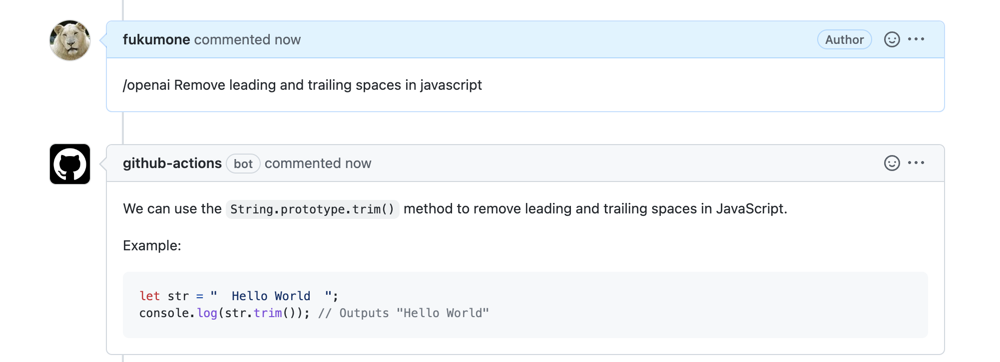

# OpenAI Chat

Uses OpenAI to reply to comments submitted



## Usage

```
on:
  issue_comment:
    types: [created]
jobs:
  action:
    runs-on: ubuntu-latest
    if: github.event_name == 'issue_comment' && startsWith(github.event.comment.body, '/openai ')
    steps:
      - name: OpenAI Chat
        uses: fukumone/openai-chat@v0.0.1
        with:
          openai-api-key: ${{ secrets.OPENAI_API_KEY }}
          github-token: ${{ secrets.GITHUB_TOKEN }}
          github-comment: ${{ github.event.comment.body }}
```

This action is triggered when a comment is posted on an issue or pull request, and the comment body starts with `/openai`. It uses the `openai-api-key`, `github-token`, and `github-comment` inputs to perform the action. 

Make sure to set the trigger to `/openai` as shown in the example above.

## Options

### Required 

Name | default value | Description
-- | -- | --
`openai-api-key` || Your openai api key
`github-comment` || The comment that was posted on GitHub
`github-token` || GitHub access token with permissions to access the repository where the comment was posted

### Optional 

Name | default value | Description
-- | -- | --
`model` | text-davinci-003 | engine to use for completion

## License

The scripts and documentation in this project are released under the [MIT](./LICENSE) License
